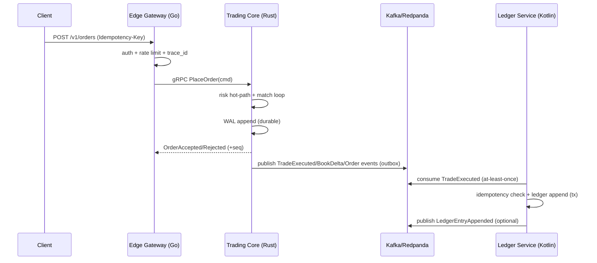
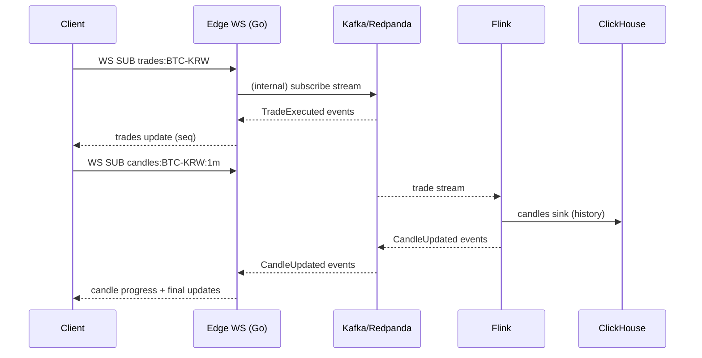

# ARCHITECTURE.md — Spot Exchange (Big‑Tech Monorepo)

## 1) High‑level topology

### Services
- **Trading Core (Rust)** — `services/trading-core`
  - per‑symbol single‑writer matching engine
  - risk hot‑path (reserve checks, limits, price band guard)
  - WAL + snapshot + replay
- **Edge Gateway (Go)** — `services/edge-gateway`
  - REST entrypoint + auth/signature + rate limit + request tracing
  - WS fan‑out (trades/book/ticker/candles) with backpressure
  - snapshot+delta + seq gap recovery
  - replay-protection cache (Redis preferred, in-memory fallback for local)
- **Ledger Service (Kotlin/Spring)** — `services/ledger-service`
  - double‑entry ledger (append‑only)
  - idempotent settlement consumer (TradeExecuted → ledger postings)
  - balances materialization + rebuild tools
  - reconciliation engine_seq ↔ ledger_applied_seq
- **Streaming (Flink)** — `streaming/flink-jobs`
  - candles (1m base), 5m/1h rollups
  - ticker(24h), analytics sinks
- **Infra**
  - Kafka/Redpanda, PostgreSQL, Redis, ClickHouse, S3 archive
  - Kubernetes + OTel + GitOps + KMS/HSM

---

## 2) Data flow (write path)

### Place order (REST → Core)

**Commit line**
- `TradeExecuted` is considered **Executed** only after Trading Core WAL durable write.
- Ledger settlement is **eventually consistent** but **idempotent** and **replayable**.

---

## 3) Data flow (market data)

### WebSocket subscriptions

**WS reliability**
- trades: loss‑minimized (should deliver all)
- book: delta conflation allowed (send latest only)
- candles: progress updates conflated; final is authoritative
- reconnect: client sends last seen `seq`; server detects gaps → snapshot + deltas

---

## 4) Storage model

### Authoritative
- Trading Core: WAL + snapshot (per symbol partition)
- Ledger: PostgreSQL append‑only tables (entries + postings)

### Read optimized
- Redis: hot orderbook snapshot, ticker, last candles
- ClickHouse: long‑term trades/candles analytics
- S3: archive snapshots/WAL segments and audit evidence

---

## 5) Key invariants (must hold)
- Engine seq is monotonic per symbol.
- Double‑entry per currency: Σ(debit‑credit)=0 across postings.
- Reserve model: available + hold = total (account/currency).
- Idempotency:
  - same `(symbol, idem_key)` command cannot produce multiple effects
  - same `trade_id` cannot create multiple ledger entries

---

## 6) Deployment (big‑tech style)
- Kubernetes:
  - separate node pools for Trading Core (low latency) and others
  - HPA for Edge, Ledger, Streaming; Trading Core scales by symbol partitioning
- GitOps:
  - ArgoCD applies env manifests; config changes are reviewed and auditable
- OTel:
  - end‑to‑end trace: edge → core → kafka → ledger

---

## 7) Local dev baseline (Gate G0)
- Local infra is provided via `infra/compose/docker-compose.yml`.
- Included services:
  - PostgreSQL, Redpanda(Kafka API), Redis, ClickHouse, MinIO, OTel Collector, Prometheus
- Contracts source of truth:
  - `contracts/proto/exchange/v1/*.proto`
  - generated outputs under `contracts/gen/{go,rust,kotlin}`

---

## 8) Failure semantics (short)
- Trading Core crash:
  - restart → snapshot load → WAL replay → resume
  - if leader change: fencing token prevents dual leader commits
- Kafka outage:
  - core continues WAL/outbox; publish resumes when Kafka returns
  - WS may degrade; clients reconnect and resync via snapshots
- Ledger outage:
  - settlement lag grows; policy may throttle/halt trading at thresholds

---

## 9) Gate G1 implementation notes
- Trading Core currently persists command results in WAL records with CRC checks.
- External publish path is through outbox records, written only after WAL durable append.
- Periodic state hash checkpoints are embedded in command processing and persisted in WAL.
- Leadership fencing token is checked before commit; stale leaders are forced to reject commits and enter halt mode.
